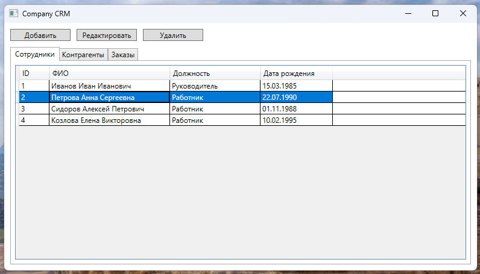

# Company CRM

Тестовое задание: десктопное приложение для управления сотрудниками, контрагентами и заказами.

## Технологии

- WPF + MVVM
- NHibernate
- MySQL
- Castle Windsor (DI)

## Требования

- Windows
- .NET Framework 4.8
- Docker Desktop

## Запуск

1. Клонировать репозиторий
2. Запустить базу данных:

```bash
docker-compose up -d
```
3. Открыть CompanyCRM.sln в Rider
4. Запустить проект

## Скриншоты

